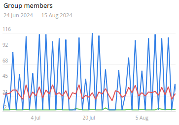

# Telegram-Member-Booster

This project is a **Telegram member booster bot**. It automatically adds members to a specific Telegram group by pulling members from other groups.  

⭐ **Please leave a star for the project.**  
This project is free and open-source. Your support with a star helps motivate future development! ⭐  

## Performance

Here are the performance results showcasing group members and growth statistics over time:

### Group Members Over Time:


### Group Growth:


## Setup

To install and set up the project:

```bash
git clone https://github.com/Er-Simon/Telegram-Member-Booster/ Telegram-Member-Booster
cd Telegram-Member-Booster
pip install -r requirements.txt
```

---

## How to Use  

1. **Add Your Telethon Sessions**:  
   - You can either place your existing session files in the `sessions` folder.  
   - Or create new session files using the `create_session.py` script:  
     - If you plan to use the script, make sure to specify the following in the `consts.py` file:  
       - **`API_ID`**: Your API ID, obtainable from [my.telegram.org](https://my.telegram.org/auth).  
       - **`API_HASH`**: Your API Hash, also obtainable from [my.telegram.org](https://my.telegram.org/auth).  
     - Run the following command:  
       ```bash
       python3 create_session.py
       ```  
     - Provide the Telegram account phone_number when prompted.  
     - The script will automatically generate and save the session file in the `sessions` folder.  

2. **Specify Group Information**:  
   In the `consts.py` file, set the following:  
   - **`GROUP_DESTINATION`**: The group where members will be added (provide the group username).  
   - **`GROUP_TARGETS`**: The groups from which members will be sourced (provide the group usernames).  
     - Ensure that the members of `GROUP_TARGETS` are visible.  
     - It's recommended that `GROUP_DESTINATION` has visible members to avoid adding duplicates.  

3. **Run the Bot**:  
   To start the bot, run:  
   ```bash
   python3 main.py
   ```  
---

## Supported Features

- **Smart Member Management**:
  The bot attempts to retrieve existing members from the destination group, then sources new members from the target groups until it has enough.
  It excludes members already present in the destination group as well as those added in previous executions, ensuring that no duplicates are added.

- **Specify Multiple Target Groups**:  
  You can define multiple groups from which to retrieve members.

- **Fresh Mode**:  
  Members are retrieved on-demand from the target groups during each execution, ensuring the most up-to-date members are processed. This feature is enabled by default and can be disabled via the `consts.py` file. If disabled, it uses the members obtained in previous executions for the account being used.

- **Filter Mode**:  
  Filters out members based on their characteristics (e.g., fake, bot, scam accounts) and their inactivity period. This feature is enabled by default and can be disabled via the `consts.py` file.

- **Logging System**:  
  Logs all actions and operations for easier tracking and debugging.

---

## Usage Recommendations 📖

- **Use Only Real Account Sessions**:  
  Always use real Telegram accounts. Avoid using accounts created with VOIP numbers or numbers from third-world countries, as these may be flagged or banned by Telegram.

- **Don't Use Fresh Sessions**
  Using newly created sessions results in significant limitations, which can lead to peer flood errors after just a few invitations. A good session should be at least one month old. In the case of fresh sessions, set the maximum number of invitations to 20 per account.

- **Un-hide Destination Group Members**
  For an initial period, it is recommended to ensure that the members of the destination group are visible. This allows you to gather member data and avoid sending invitations to users who are already part of the target group.

- **Do Not Change Action Limits in `consts.py`**:  
  The action limits in the `consts.py` file have been thoroughly tested. Modifying them could lead to errors, restrictions, or account bans.

- **Utilize 8 Different Accounts**:  
  To maximize the growth of your group, it’s recommended to add at least 8 different Telegram session files in the `sessions` folder. This helps distribute the load across multiple accounts and ensures more efficient growth. 

---

## Future Releases 🚀

Additional features will be released as the project gains more stars:

- **Proxy System Based on User's Phone Number**  
  *Release at 150 stars* ⭐

- **Automated Session Creation**  
  *Release at 250 stars* ⭐

---

## ⚠️ Legal Disclaimer ⚠️

This software is intended for educational purposes only. It is designed to demonstrate how automation tools can interact with Telegram. However, using this bot to add members to Telegram groups may violate Telegram's terms of service. The author is not responsible for any misuse of this tool or any consequences arising from its improper use.

You are solely responsible for complying with all applicable laws and terms of service, including but not limited to Telegram’s policies. Misuse of this software may lead to restrictions, account bans, or legal action.

If any legal concerns arise, please contact the project owner directly.

---

## Contributions & Feedback

The project is still in development. If you find any bugs or have suggestions for improvement, feel free to open an issue. ⚠️

